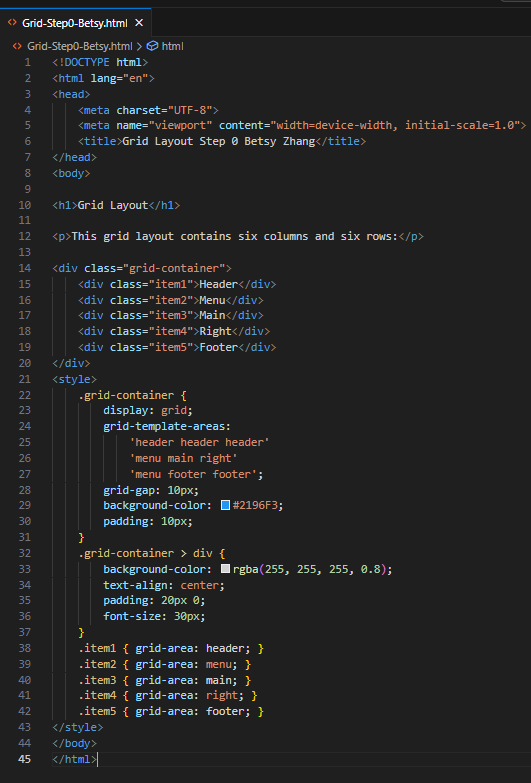
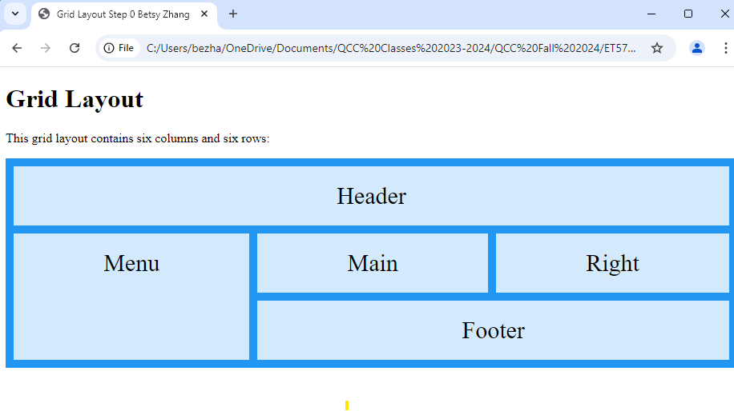
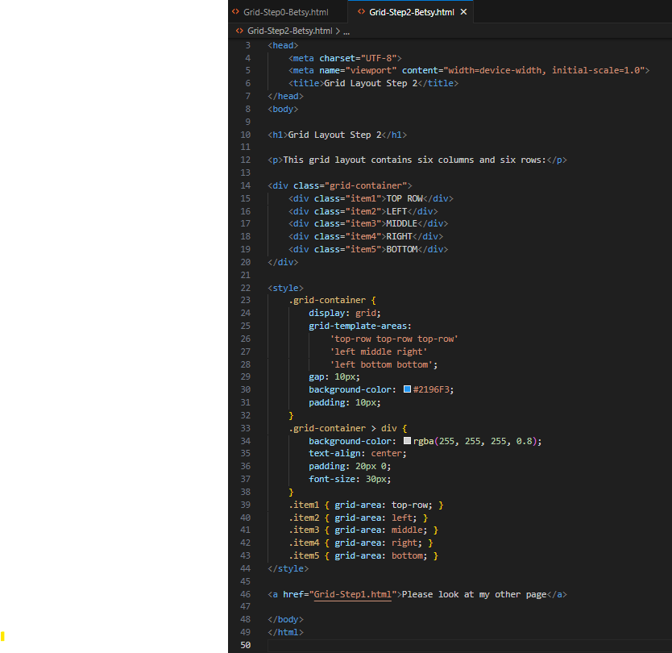
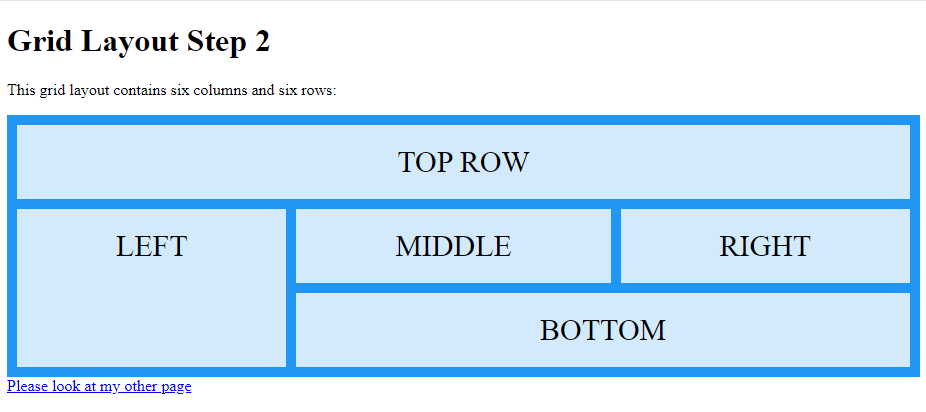
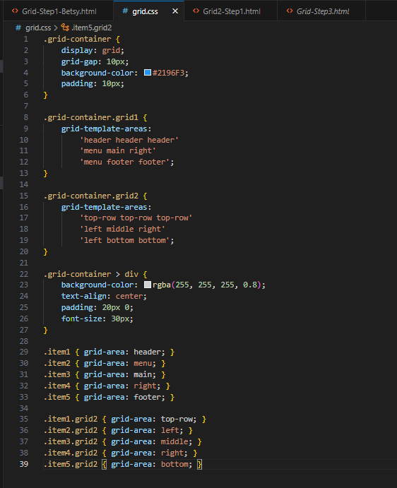

# Multi-Page HTML with Internal vs External Styling Instructions

## Part 1: Multiple HTML with Internal Styling vs External Styling  

1. **Start by creating a multi-column grid with an HTML page.**  
   - Name the file `Grid-Step0-Betsy.html`.  
   - Create a few items:  
     - **Item 1:** Header  
     - **Item 2:** Menu  
     - **Item 3:** Main  
     - **Item 4:** Right  
     - **Item 5:** Footer  
   - Define them in the `<style>` section using `grid-area`, with class IDs inline with the HTML document as shown at the end of the document.
   

2. **Save the document as `.html` and open it in a browser.**  
   - The layout should look as follows:  
     - The **masthead area** (top row) should display "Header".  
     - The **middle section** should have three columns: Menu, Main, and Right.  
     - The **bottom section** should have two columns: Menu and Footer.  
   - Save this version as `Grid-Step1-Betsy.html`.  
   

---

## Part 2: Create Page 2  

3. **Repeat the steps above to create a second file.**  
   - Name the file `Grid-Step2-Betsy.html`.  
   - Create a few items:  
     - **Item 1:** TOP ROW  
     - **Item 2:** LEFT  
     - **Item 3:** MIDDLE  
     - **Item 4:** RIGHT  
     - **Item 5:** BOTTOM  
   - Define them in `<style>`.
   

4. **Save the document and open it in a browser.**  
   - The layout should look as follows:  
     - The **masthead area** (top row) should display "TOP ROW".  
     - The **middle section** should have three columns: LEFT, MIDDLE, and RIGHT.  
     - The **bottom section** should have two columns: LEFT and BOTTOM.  
   

---

## Part 3: Add Connection Between Pages  

5. **Add a hyperlink reference to both pages.**  
   - Example for `Grid-Step1-Betsy.html`:  
     ```html
     <a href="Grid2-Step2.html">Please look at my other page</a>
     ```  
   - Repeat for `Grid-Step2-Betsy.html` with a link back to the first page.  
   [Connection Video with Code + Results](https://drive.google.com/file/d/1nk8fTko8UNKE_cW8IupOTFHwUHfIXp9t/view?usp=drive_link)

---

## Part 4: Remove Internal Styles and Link External CSS  

6. **Remove the `<style>` section from both files (`Grid-Step1` and `Grid-Step2`).**  
   - Save them as `Grid-Step1.html` and `Grid2-Step1.html`.  
   [Remove style tag code + results](https://drive.google.com/file/d/1nw5IA3U5MS7aI6O27bLiwmqWFXJIs7Wi/view?usp=drive_link)

7. **Create a new file called `grid.css`.**  
   - Paste the contents removed from the `<style>` section into this `.css` file.  
   - Save the CSS file as `grid.css`.  
      


8. **Update the HTML files to include the external stylesheet.**  
   - Add this `<link>` in the `<head>` section of each HTML file:  
     ```html
     <link rel="stylesheet" type="text/css" href="grid.css">
     ```  
   - Save and reopen the files in a browser.  
   - **Answer A:** Explain why the grid formatting was lost initially and how linking the external stylesheet restored it.  
     - Grid formatting was lost initially because everything in the styles tag was removed. Linking the external stylesheet restored it by applying the defined css into the HTML file with the <link> tag in the heading.
---

## Part 5: Use `@import` Instead of `<link>`  

9. **Replace the `<link>` tag with `@import` in both HTML files.**  
   - Add the following inside a `<style>` section:  
     ```html
     <style>@import url("grid.css");</style>
     ```  
   - Save them as `Grid-Step2.html` and `Grid2-Step2.html`.  

10. **Reopen the files and ensure the styles are correctly applied.**  

11. **Add navigation between the pages.**  
    - Example:  
      ```html
      <a href="Grid-step2-Betsy.html">Please look at my other page</a>
      ```  
    - Navigate between pages by clicking the link.
   [@import css and edited navigation links](https://drive.google.com/file/d/1nqzJUC94PWeDXvoMowVyNWzHoUx3muir/view?usp=drive_link)

---

## Part 6: Test Responsiveness  

12. **Make any changes to `grid.css`.**  
    - Verify that the changes are reflected on both pages.  
   [Changing one line in grid.css worked for both pages.](https://drive.google.com/file/d/1epWFUxtGktGrT-Sq25PthwTBRoT3ZNwc/view?usp=drive_link)

13. **Increase the width and height of the browser by dragging the corners.**  
    - Observe that the size of all columns adjusts automatically.  
   [Responsive Design Check](https://drive.google.com/file/d/18vL2eYJBglXFlIlBUFtFyj2qRb4cWA55/view?usp=drive_link)

14. **Answer:** Explain why using external styles with either `<link>` or `@import` ensures consistency and maintainability across pages.
    - Because multiple pages can be linked to the external stylesheet. Once you change something in a stylesheet, that change will affect all linked html pages.
